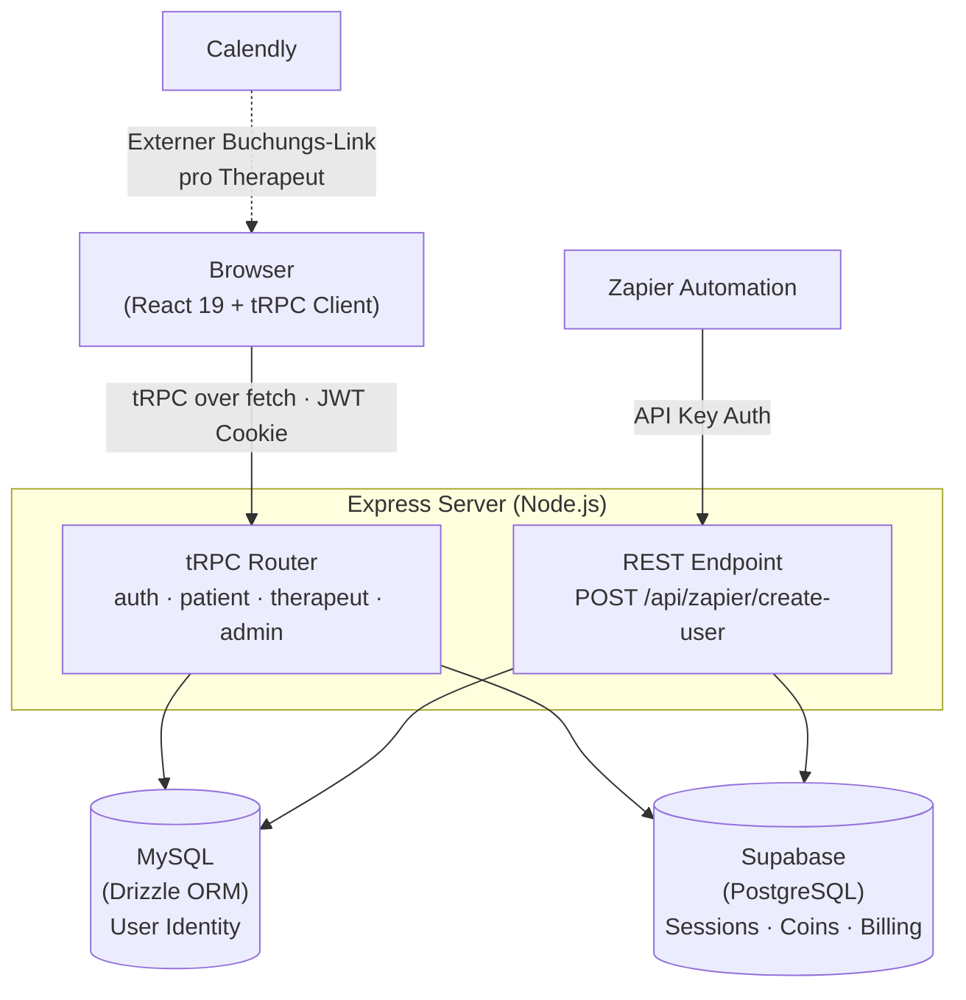

# Healing Humans Dashboard

Rollenbasiertes Web-Dashboard für eine telemedizinische Therapieplattform. Patienten buchen Sitzungen, verfolgen ein Coin-Prämiensystem und geben Bewertungen ab. Therapeuten verwalten ihre Sitzungen. Admins kontrollieren Nutzer, Abrechnung, Coins und Calendly-Integrationen.

## Architektur



Die Anwendung nutzt eine **Dual-Datenbank-Strategie**: MySQL mit Drizzle ORM verwaltet User-Identität und Authentifizierung; Supabase hält die operationalen Daten (Sessions, Coins, Abrechnungen, Referrals, Bewertungen). Beide Welten sind über das `supabaseId`-Feld im User-Record verknüpft.

## Tech Stack

| Layer | Technologie | Warum |
|-------|-------------|-------|
| Frontend | React 19, Vite 7 | Aktuellster stabiler Release-Stand |
| Routing | Wouter v3 | ~1.3 kB statt ~50 kB (React Router) — [ADR-004](docs/adr/004-wouter-statt-react-router.md) |
| UI | Radix UI + shadcn/ui, TailwindCSS 4 | Accessible-by-default Primitiven |
| API-Layer | tRPC v11 + TanStack Query | End-to-end Typsicherheit ohne Codegenerierung — [ADR-001](docs/adr/001-trpc-statt-rest.md) |
| Backend | Express.js, tsx | Minimaler HTTP-Server, direktes TS in Dev |
| Auth | bcrypt + JWT (jose) in HttpOnly Cookie | XSS-resistente Session — [ADR-003](docs/adr/003-jwt-httponly-cookie.md) |
| App-DB | MySQL + Drizzle ORM | Schema-as-Code, typisierte Queries, SQL-Migrationen — [ADR-002](docs/adr/002-dual-datenbank.md) |
| Op-Daten | Supabase (PostgreSQL) | Managed Service für transaktionale Daten — [ADR-002](docs/adr/002-dual-datenbank.md) |
| Testing | Vitest (Unit), Playwright (E2E) | Schnelle Unit-Tests + echte Browser-Tests für Auth-Flows |
| Automation | Zapier-Webhook | Externer User-Import aus Skool ohne Dashboard-Zugang |

## Projektstruktur

```
healing-humans/
├── client/                  # React-Frontend
│   └── src/
│       ├── pages/           # Rollenbasierte Views (patient, therapeut, admin, login)
│       └── components/      # Shared UI-Komponenten
├── server/                  # Express + tRPC
│   ├── _core/               # Infrastruktur (tRPC-Setup, Auth-Context, Server-Einstieg)
│   │   ├── index.ts         # Express-Setup, tRPC-Mount, Vite-Dev-Proxy
│   │   ├── trpc.ts          # t.procedure, protectedProcedure, roleProcedure
│   │   ├── context.ts       # Request-Context: JWT aus Cookie auslesen
│   │   └── cookies.ts       # JWT signieren / verifizieren (jose)
│   ├── routers.ts           # Alle tRPC-Procedures
│   ├── db.ts                # Drizzle-Datenbankzugriff (MySQL)
│   ├── supabase.ts          # Supabase-Client (operationale Daten)
│   └── zapier.ts            # REST-Endpoint für Zapier-Integration
├── shared/                  # Typen und Konstanten (client + server)
├── drizzle/                 # Schema + versionierte SQL-Migrationen
│   ├── schema.ts            # users-Tabelle (Drizzle-Schema)
│   └── 0000…0004.sql        # Migration-History
├── e2e/                     # Playwright E2E-Tests
└── docs/
    └── adr/                 # Architecture Decision Records
```

## Rollen & Berechtigungen

| Aktion | Patient | Therapeut | Admin |
|--------|:-------:|:---------:|:-----:|
| Coin-Balance & Transaktionen | ✓ | | |
| Sitzung buchen (Calendly-Link) | ✓ | | |
| Bewertung abgeben | ✓ | | |
| Referral-Status einsehen | ✓ | | |
| Eigene Sitzungen verwalten | | ✓ | |
| Sitzung als erledigt markieren | | ✓ | |
| Nutzer anlegen / Rollen setzen | | | ✓ |
| Coins anpassen | | | ✓ |
| Calendly-Links pro Therapeut setzen | | | ✓ |
| Abrechnungsanfragen verwalten | | | ✓ |

## Architekturentscheidungen (ADRs)

Die Begründungen für die wesentlichen Technologieentscheidungen sind als Architecture Decision Records dokumentiert:

- [ADR-001 – tRPC statt klassischer REST-API](docs/adr/001-trpc-statt-rest.md)
- [ADR-002 – Dual-Datenbank: Drizzle/MySQL + Supabase](docs/adr/002-dual-datenbank.md)
- [ADR-003 – JWT in HttpOnly Cookie statt localStorage](docs/adr/003-jwt-httponly-cookie.md)
- [ADR-004 – Wouter statt React Router](docs/adr/004-wouter-statt-react-router.md)

## Lokale Entwicklung

```bash
# Abhängigkeiten installieren
pnpm install

# .env konfigurieren
cp .env.example .env
# Werte eintragen (DATABASE_URL, JWT_SECRET, SUPABASE_URL, SUPABASE_SERVICE_ROLE_KEY)

# Datenbank-Schema anwenden
pnpm db:push

# Dev-Server starten (Frontend + Backend im selben Prozess via Vite-Proxy)
pnpm dev
# → http://localhost:5174
```

**Erforderliche Umgebungsvariablen:**

| Variable | Beschreibung |
|----------|-------------|
| `DATABASE_URL` | MySQL-Connection-String |
| `JWT_SECRET` | Mindestens 32 Zeichen, zufällig generiert |
| `SUPABASE_URL` | Projekt-URL aus Supabase Dashboard |
| `SUPABASE_SERVICE_ROLE_KEY` | Service-Role-Key (Server-only, nie im Browser) |
| `ZAPIER_API_KEY` | Beliebiger geheimer Wert für Zapier-Webhook |

## Tests

```bash
# Unit-Tests (Vitest) — 15 Tests
pnpm test

# E2E-Tests (Playwright) — 22 Tests
pnpm test:e2e

# HTML-Report nach E2E-Lauf
pnpm test:e2e:ui
```

Die E2E-Tests decken die kritischen Flows ab: Login für alle drei Rollen, Rollenwechsel durch Admin, Dashboard-Rendering und Logout. Die Unit-Tests testen die tRPC-Procedures isoliert.

## Deployment

Vorkonfiguriert für **Railway** (`railway.json`) und **Render** (`render.yaml`). Der Build-Schritt erzeugt eine einzelne Ausgabedatei:

```bash
pnpm build   # Vite-Frontend-Build + esbuild Server-Bundle → dist/
pnpm start   # NODE_ENV=production node dist/index.js
```

---

**Tobias Buß** · Hamburg · [github.com/tib019](https://github.com/tib019)
